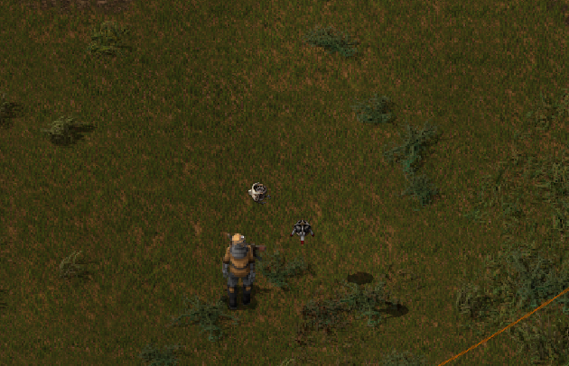
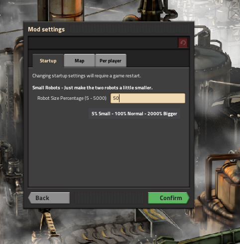
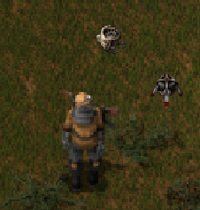

# Small Robots

**Small Robots** is a Factorio tweak mod that allows you to change the size of logistic, construction, and combat bots. You can scale both vanilla and modded bots anywhere between 50% and 250% of their original size. 

This mod is the perfect companion for [miniMAXIme](https://mods.factorio.com/mod/minime).

---

## Previews

  
  
  

---

## Features

* **Complete Bot Scaling:** Adjust the physical size of all logistic, construction, and combat bots.
* **Modded Bot Support:** Works seamlessly with vanilla prototypes and bots introduced by other mods.
* **Alt-Mode Optimization:** Includes an option to hide item icons being carried by shrunk bots to prevent visual clutter in Alt-Mode.

---

## Mod Settings

You can adjust these values under `Options` → `Mod settings` → `Startup`:

* **Robot Size (`5%` – `500%`):** Set the scale percentage for standard bots. *(Default: 50%)*
  * *Small:* 5% – 99%
  * *Standard:* 100%
  * *Large:* 101% – 500%
* **Atomic Bots Scaling Modifier (`0.1` – `1.0`):** Atomic bots are inherently much larger than vanilla bots. If they are still too big after adjusting the main robot size, use this modifier to shrink them independently. *(Default: 0.3)*
* **Hide Carried Item Icons (Toggle):** When enabled, item icons carried by bots will not be rendered while Alt-Mode is active, keeping your screen clean.

---

## Credits & Links

* **Author:** Developed by [Pi-C](https://mods.factorio.com/user/pi-c).
* **Mod Portal:** View the official page on the [Factorio Mod Portal](https://mods.factorio.com/mod/SmallRobots).